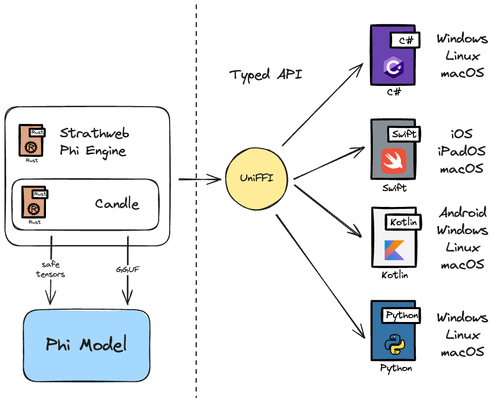

# Strathweb Phi Engine

A cross-platform library for running Microsoft's [Phi models](https://azure.microsoft.com/en-us/products/phi) locally using [candle](https://github.com/huggingface/candle) in GGUF and safe tensors format.

## Supported platforms

|                        | **Swift**                                        | **.NET**                                                                                    | **Kotlin**                        | **Python**                                                  |
|------------------------|--------------------------------------------------|---------------------------------------------------------------------------------------------|-----------------------------------|-------------------------------------------------------------|
| **Package**            | Swift Package                                    | Nuget                                                                                       | N/A                               | N/A                                                         |
| **Manual Integration** | Bindings + XCFramework Bindings + native library | Bindings + native library                                                                   | Bindings + native library         | Bindings + native library                                   |
| **Platforms**          | macOS arm64<br/>iOS                                  | Windows x64<br/>Windows arm64 (not via Nuget)<br/>Linux x64<br/>Linux arm64 (not via Nuget)<br/>macOS arm64 | Windows x64<br/>Linux x64<br/>macOS arm64 | Windows x64<br/>Windows arm64<br/>Linux x64<br/>Linux arm64<br/>macOS arm64 |



## Building instructions

### Swift

Build the Swift Package (arm64 Mac required).

```shell
./build-swift.sh
```

This builds:
 - the Swift Package under `packages/swift/Strathweb.Phi.Engine`
 - XCFramework under `artifacts/swift/strathweb_phi_engine_framework.xcframework`

Now open `samples/io/phi.engine.sample/phi.engine.sample.xcodeproj` and build the SwiftUI app (iOS), or go to `samples/swift` and run `./run.sh` (macOS) to launch the Swift console app.

### C#

Install UniFFI C# bindings generator

```shell
cargo install uniffi-bindgen-cs --git https://github.com/NordSecurity/uniffi-bindgen-cs --tag v0.10.0+v0.29.4
```

Build the Nuget package for your platform:

```shell
./build-dotnet.sh
```

or (on Windows)

```cmd
build-dotnet.bat
 ```

or

```shell
cargo build --release --manifest-path strathweb-phi-engine/Cargo.toml
dotnet build packages/csharp -c Release
dotnet pack packages/csharp -c Release -o artifacts/csharp
```

Nuget package will be in `artifacts/csharp/Strathweb.Phi.Engine.x.x.x.nupkg`.
(Optional) Run the sample console app:

```shell
cd samples/csharp/console
dotnet run -c Release
```

### Kotlin

Run the sample console app:

```shell
cd samples/kotlin
./run.sh
```

### Python

Run the sample console app:

```shell
cd samples/python/console
./run.sh # or run.bat on Windows
```

or use the Jupyter Notebooks

```shell
cd samples/python/jupyter
./init.sh # or init.bat on Windows
```

Now open the Notebook and run the cells.

## Compatibility notes

### .NET

✅ Tested on Windows arm64

✅ Tested on Windows x64

✅ Tested on Linux arm64

✅ Tested on Linux x64

✅ Tested on macOS arm64.

The NuGet package is built when running `./build-dotnet.sh` (`build-dotnet.bat` on Windows).

### Swift

✅ Tested on macOS arm64.

✅ Tested on iPad Air M1 8GB RAM

✅ Should work on 6GB RAM iPhones too

❌ Will not work on 4GB RAM iPhones

However, for 4GB RAM iPhones, it's possible to use the (very) low fidelity Q2_K quantized model. Such model is not included in the official Phi-3 release, but I tested [this one from HuggingFace](https://huggingface.co/SanctumAI/Phi-3-mini-4k-instruct-GGUF) on an iPhone 12 mini successfully.

### Kotlin

✅ Tested on macOS arm64.

### Python

✅ Tested on Windows arm64

✅ Tested on macOS arm64.

## GPU Support

Currently the library supports Metal on MacOS. On other platforms only CPU is supported.

## AutoGen

The repository also contains a C# integration library for [AutoGen](https://github.com/microsoft/autogen/tree/dotnet/dotnet), called `Strathweb.Phi.Engine.AutoGen`. There is an example in the `samples/csharp/autogen` folder. It allows creating a local Phi-3 agent and integrating it into the other typical AutoGen workflows.


## Agent Framework

The repository also features a C# integration library for [Microsoft Agent Framework](https://github.com/microsoft/agent-framework), called `Strathweb.Phi.Engine.AgentFramework`. You can explore an example in the `samples/csharp/agent-framework` folder. It enables wrapping your local Phi-3 engine inside an `AIAgent` directly, seamlessly joining agentic workflows with functions and capabilities.

## Blog posts

📝 an initial [announcement post](https://strathweb.com/2024/07/announcing-strathweb-phi-engine-a-cross-platform-library-for-running-phi-3-anywhere/)

📝 safe tensors [announcement post](https://www.strathweb.com/2024/11/strathweb-phi-engine-now-with-safe-tensors-support/)

📝 [AutoGen library](https://www.strathweb.com/2024/09/using-local-phi-3-models-in-autogen-with-strathweb-phi-engine/)

📝 [.NET examples and Microsoft.Extensions.AI support](https://www.strathweb.com/2024/12/running-phi-inference-in-net-applications-with-strathweb-phi-engine/)

